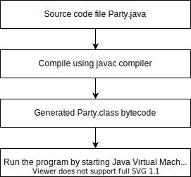
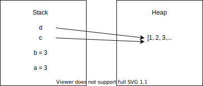

# Head First Java
## [Chapter-1] Breaking the Surface
### The way Java works
* **Source**: Create a source document. Use an established protocol. (In this case, the Java language)
* **Compiler**: Run your document through a source code compiler. The compiler checks for errors and won't let you compile unless it's satisfied that everything will run correctly.
* **Output (Code)**: The compiler creates a new document coded into Java bytecode. Any device capable of running Java will be able to interpret/translate this file into something it can run. The compiled bytecode is platform independent. 
* **Virtual Machines**: The virtual machines reads and runs the bytecode.
<br/><br/>


### Compaitability between boolean and int
* Not compaitable in Java

### Static vs Dynamic Binding
1. Static binding in Java occurs during compile time while dynamic binding occurs during runtime. 
2. **private**, **final** and **static** methods and variables use static bonding and are bounded by compiler while virtual methods are bonded during runtime based upon runtime object. 
3. Static bonding uses **Type** (**class** in Java) information for binding while dynamic binding uses object to resolve binding. 
4. Overloaded methods are bonded using static binding while overriden methods are bonded using dynamic binding at runtime. 

#### Static binding example in Java
```java
public class StaticBindingTest {  
    public static void main(String args[]) {
        Collection c = new HashSet();
        StaticBindingTest et = new StaticBindingTest();
        et.sort(c);
    }
    //overloaded method takes Collection argument
    public Collection sort(Collection c) {
        System.out.println("Inside Collection sort method");
        return c;
    }
    //another overloaded method which takes HashSet argument which is sub class
    public Collection sort(HashSet hs) {
        System.out.println("Inside HashSet sort method");
        return hs;
    }
}
```
#### Dynamic binding example in Java
```java
public class DynamicBindingTest {   
    public static void main(String args[]) {
        Vehicle vehicle = new Car(); //here Type is vehicle but object will be Car
        vehicle.start(); //Car's start called because start() is overridden method
    }
}

class Vehicle {
    public void start() {
        System.out.println("Inside start method of Vehicle");
    }
}

class Car extends Vehicle {
    @Override
    public void start() {
        System.out.println("Inside start method of Car");
    }
}
```
### Is JVM compiler or interpreter?
JVM runs/interprets/translates bytecode into native machine code. JVM is interpreter.

## [Chapter-2] A Trip to Objectville
### Difference between Class and Object
* A class is a blueprint for an object. It tells the virtual machine to make an object of that particular type. 
* Things an object knows about itself are called instance variables / state.
* Things an object can do are called methods.

### Garbage Collectible Heap
Each time an object is created in Java, it goes into an area of memory known as the 'the heap'. All objects no matter when, where or how they're created, live on the heap. The Java heap is actually called the Garbage-Collectible Heap. When you create an object, Java allocates memory space on the heap according to how much that particular object needs.<br/><br/>
When the JVM can 'see' that an object can never be used again, that object becomes eligible for garbage collection. And if you're runnning low on memory, the garbage collector will run, throw the unreachable objects, and free up the space, so that the space can be reused.

### Global Variables & Constants
* **public static** -> global variable
* **public static final** -> global constant

## [Chapter-3] Know Your Variables
### Primitive and Reference Variables
* Variables are of two types: primitive and reference
* Variables must always be declared with a name and a type.
* A primitive variable value is the bits representing the value.
* A reference varibale value is the bits representing a way to get to an object on the heap.
* A reference variable has a value of null when it is not referencing any object.
* An array is always an object, even if the array is declared to hold primitives. 

### Bit Depth of Primitive Types
<table><tr><td class="selected" style="text-align: left; vertical-align: top;"><div class="wrap"><div class="" contenteditable="false" style="margin: 10px 5px;"><p><span>Type</span></p></div></div></td><td class="selected" style="text-align: left; vertical-align: top;"><div class="wrap"><div class="" contenteditable="false" style="margin: 10px 5px;"><p><span>Bit Depth</span></p></div></div></td></tr><tr><td class="selected" style="text-align: left; vertical-align: top;"><div class="wrap"><div class="" contenteditable="false" style="margin: 10px 5px;"><p><span>boolean</span></p></div></div></td><td class="selected" style="text-align: left; vertical-align: top;"><div class="wrap"><div class="" contenteditable="false" style="margin: 10px 5px;"><p><span>JVM specific</span></p></div></div></td></tr><tr><td class="selected" style="text-align: left; vertical-align: top;"><div class="wrap"><div class="" contenteditable="false" style="margin: 10px 5px;"><p><span>char</span></p></div></div></td><td class="selected" style="text-align: left; vertical-align: top;"><div class="wrap"><div class="" contenteditable="false" style="margin: 10px 5px;"><p><span>16 bits</span></p></div></div></td></tr><tr><td class="selected" style="text-align: left; vertical-align: top;"><div class="wrap"><div class="" contenteditable="false" style="margin: 10px 5px;"><p><span>byte</span></p></div></div></td><td class="selected" style="text-align: left; vertical-align: top;"><div class="wrap"><div class="" contenteditable="false" style="margin: 10px 5px;"><p><span>8 bits</span></p></div></div></td></tr><tr><td class="selected" style="text-align: left; vertical-align: top;"><div class="wrap"><div class="" contenteditable="false" style="margin: 10px 5px;"><p><span>short</span></p></div></div></td><td class="selected" style="text-align: left; vertical-align: top;"><div class="wrap"><div class="" contenteditable="false" style="margin: 10px 5px;"><p><span>16 bits</span></p></div></div></td></tr><tr><td class="selected" style="text-align: left; vertical-align: top;"><div class="wrap"><div class="" contenteditable="false" style="margin: 10px 5px;"><p><span>int</span></p></div></div></td><td class="selected" style="text-align: left; vertical-align: top;"><div class="wrap"><div class="" contenteditable="false" style="margin: 10px 5px;"><p><span>32 bits</span></p></div></div></td></tr><tr><td class="selected" style="text-align: left; vertical-align: top;"><div class="wrap"><div class="" contenteditable="false" style="margin: 10px 5px;"><p><span>long </span></p></div></div></td><td class="selected" style="text-align: left; vertical-align: top;"><div class="wrap"><div class="" contenteditable="false" style="margin: 10px 5px;"><p><span>64 bits</span></p></div></div></td></tr><tr><td class="selected" style="text-align: left; vertical-align: top;"><div class="wrap"><div class="" contenteditable="false" style="margin: 10px 5px;"><p><span>float </span></p></div></div></td><td class="selected" style="text-align: left; vertical-align: top;"><div class="wrap"><div class="" contenteditable="false" style="margin: 10px 5px;"><p><span>32 bits</span></p></div></div></td></tr><tr><td class="selected" style="text-align: left; vertical-align: top;"><div class="wrap"><div class="" contenteditable="false" style="margin: 10px 5px;"><p><span>double </span></p></div></div></td><td class="selected" style="text-align: left; vertical-align: top;"><div class="wrap"><div class="" contenteditable="false" style="margin: 10px 5px;"><p><span>64 bits</span></p></div></div></td></tr></table>

### 'f' Suffix for Float
Floats should have 'f' suffix, because Java thinks anything with a floating point is a double, unless you use 'f'.

### Type Casting
#### Widening / Implicit casting
Both types are compaitable and target type is larger than source type. 
```java
    byte i = 40;
    short j = i;
```
#### Narrowing / Explicit casting
Assigning a larget type to smaller type.
```java
    double d = 30.0;
    float f = d;
```

### Variable Naming
* Start with a letter, underscore(_) or dollar sign($). Can't start with number or other charcters. 
* Cannot be reserved keywords. 

### Size of Reference Variables
All references for a given JVM will be the same size regardless of the objects they reference, but each 
JVM might have a different way of representing references, so references on one JVM may be smaller or
larger than references on another JVM.

### Storing variables on Stack/Heap
* All data for primitive type variables is stored on the stack.
* For reference type, the stack holds a pointer to the object on the heap.
* When setting a reference type variable equal to another reference type variable,
a copy of only the pointer is made.
* Certain object types (e.g. **Immutable**) can't be manipulated on the heap.

```java
    int a = 3;
    int b = a;

    int[] c = {1, 2, 3, 4};
    int[] d = c;
```


## [Chapter-4] How Objects Behave

### Pass by value or pass by reference?
Java is always pass by value

### Do I have to return the exact type I declared?
You can return anything that can be implicitly promoted to that type. You must use an explicit cast when
 the declared type is smaller than what you're trying to return.

### Encapsulation
* Mark instance variables private
* Mark getters and setters public

### Instance and Local Variables
* Instance variables are declared inside a class but not within a method.
* Local variables are declared within a method. 
* Local variables do not get a default value. So local variables must be initialized before use. 
* Method parameters are the same as local variables, as they're declared inside the method.

### Comparing Variables
* **Primitives**: To comapre two primitives, use the **==** operator.
* **References**: To see if two references are the same (which means if they refer to the same object on the heap)
 use the **==** operator.