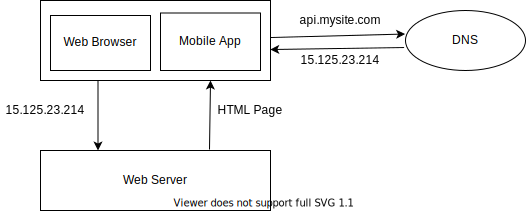
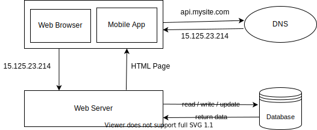
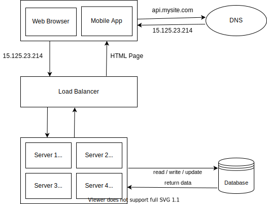

# System Design Basics
## Single Server Setup

1. User access websites through domain names, such as api.mysite.com. Usually the Domain 
Name System (DNS) is a paid service provided by 3rd parties and not hosted by our servers.
2. Internet Protocol (IP) address is returned to the browser or mobile app. In the example,
IP address 15.125.23.214 is returned.
3. Once the IP address is obtained, Hypertext Transfer Protocol (HTTP) requests are
sent directly to web server.
4.  The web server returns HTML pages or JSON response for rendering.
### Traffic Source for Web Server
The traffic to web server comes from two sources: web application and mobile application.<br />
1. Web Application: Uses a combination of server-side languages (Java, Python, etc.) to
handle business logic, storage, etc., and client-side languages (HTML and JavaScript) for
presentation.
2. Mobile Application: HTTP protocol is the communication protocol between the mobile
app and the web server. JavaScript Object Notation (JSON) is commonly used API
response format to transfer data due to its simplicity. An example of the API response in
JSON format is shown below:<br /><br />
GET /users/12 – Retrieve user object for id = 12
```json
{
    "id": 12,
    "firstName": "John",
    "lastName": "Smith",
    "address": {
        "streetAdress": "21 2nd Street",
        "city": "New York",
        "state": "NY",
        "postalCode": 10021
    },
    "phoneNumbers": [
        "212 555-1234",
        "646 555-4567"
    ]
}
```
## Database
With the growth of the user base, one server is not enough, and we need multiple servers: one
for web/mobile traffic, the other for the database. Separating web/mobile traffic
(web tier) and database (data tier) servers allows them to be scaled independently.<br /><br />

### Which databases to use?
Relational databases are also called a relational database management system (RDBMS) or SQL database. The most popular ones are MySQL, Oracle database, PostgreSQL etc. Relational databases represent and store data in tables and rows. You can perform join operations using SQL across different database tables. <br /><br /> 

Non-relational databases are also called NoSQL databases. Popular ones are CouchDB, Neo4j, Cassandra, HBase, Amazon DynamoDB etc. These databases are grouped into four categories: key-value stores, graph stores, column stores and document stores. Join operations are generally not supported in non-relational databases. <br /><br /> 

Non-relational databases might be the right choice if: <br/>
* Application requires super low latency. 
* Data are unstructured, or do not have any relational data.
* Only need to serialize and deserialize data (JSON, XML, YAML etc.)
* Need to store a massive amount of data.
## Vertical Scaling vs Horizontal Scaling
Vertical scaling, referred to as “scale up”, means the process of adding more power (CPU,
RAM, etc.) to servers. Horizontal scaling, referred to as “scale-out”, allows to scale
by adding more servers into your pool of resources.<br/><br/>
When traffic is low, vertical scaling is a great option, and the simplicity of vertical scaling is
its main advantage. Unfortunately, it comes with serious limitations.<br/>
* Vertical scaling has a hard limit. It is impossible to add unlimited CPU and memory to a
single server.
* Vertical scaling does not have failover and redundancy. If one server goes down, the
website/app goes down with it completely.
## Load Balancer
A load balancer evenly distributes incoming traffic among web servers that are defined in a
load-balanced set.<br/><br/>

Users connect to the public IP of the load balancer directly. For better security, private
IPs are used for communication between servers. A private IP is an IP address reachable only
between servers in the same network.
<br/><br/>
With this architecture, we solved no failover issue and improved availability of the web tier. <br/>
* If server 1 goes offline, all the traffic will be routed to server 2, 3 & 4. This prevents the website from going offline.
* If the website traffic grows rapidly, and four servers are not enough to handle the traffic, the load balancer can handle this problem gracefully. We only need to add more servers to the web server pool, and the load balancer automatically starts to send requests to them.
## Database Replication
## Cache
## Content Delivery Network (CDN)
## Stateless Web Tier
## Data Centres
## Message Queue
## Logging, Metrics, Automation
## Database Scaling
## Millions of users and Beyond
## Constants
### Power of two
### Latency Numbers
### Availability Numbers
