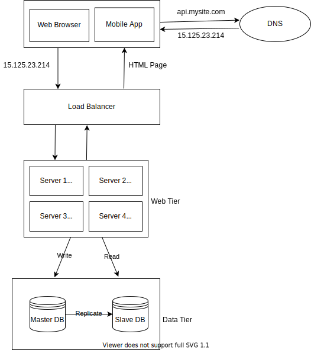
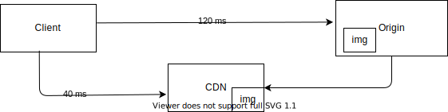
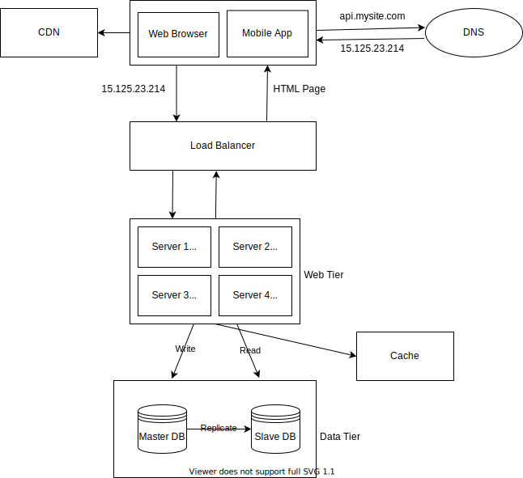

# System Design Basics
## Single Server Setup

1. User access websites through domain names, such as api.mysite.com. Usually the Domain 
Name System (DNS) is a paid service provided by 3rd parties and not hosted by our servers.
2. Internet Protocol (IP) address is returned to the browser or mobile app. In the example,
IP address 15.125.23.214 is returned.
3. Once the IP address is obtained, Hypertext Transfer Protocol (HTTP) requests are
sent directly to web server.
4.  The web server returns HTML pages or JSON response for rendering.
### Traffic Source for Web Server
The traffic to web server comes from two sources: web application and mobile application.<br />
1. Web Application: Uses a combination of server-side languages (Java, Python, etc.) to
handle business logic, storage, etc., and client-side languages (HTML and JavaScript) for
presentation.
2. Mobile Application: HTTP protocol is the communication protocol between the mobile
app and the web server. JavaScript Object Notation (JSON) is commonly used API
response format to transfer data due to its simplicity. An example of the API response in
JSON format is shown below:<br /><br />
GET /users/12 – Retrieve user object for id = 12
```json
{
    "id": 12,
    "firstName": "John",
    "lastName": "Smith",
    "address": {
        "streetAdress": "21 2nd Street",
        "city": "New York",
        "state": "NY",
        "postalCode": 10021
    },
    "phoneNumbers": [
        "212 555-1234",
        "646 555-4567"
    ]
}
```
## Database
With the growth of the user base, one server is not enough, and we need multiple servers: one
for web/mobile traffic, the other for the database. Separating web/mobile traffic
(web tier) and database (data tier) servers allows them to be scaled independently.<br /><br />

### Which databases to use?
Relational databases are also called a relational database management system (RDBMS) or SQL database. The most popular ones are MySQL, Oracle database, PostgreSQL etc. Relational databases represent and store data in tables and rows. You can perform join operations using SQL across different database tables. <br /><br /> 

Non-relational databases are also called NoSQL databases. Popular ones are CouchDB, Neo4j, Cassandra, HBase, Amazon DynamoDB etc. These databases are grouped into four categories: key-value stores, graph stores, column stores and document stores. Join operations are generally not supported in non-relational databases. <br /><br /> 

Non-relational databases might be the right choice if: <br/>
* Application requires super low latency. 
* Data are unstructured, or do not have any relational data.
* Only need to serialize and deserialize data (JSON, XML, YAML etc.)
* Need to store a massive amount of data.
## Vertical Scaling vs Horizontal Scaling
Vertical scaling, referred to as “scale up”, means the process of adding more power (CPU,
RAM, etc.) to servers. Horizontal scaling, referred to as “scale-out”, allows to scale
by adding more servers into your pool of resources.<br/><br/>
When traffic is low, vertical scaling is a great option, and the simplicity of vertical scaling is
its main advantage. Unfortunately, it comes with serious limitations.<br/>
* Vertical scaling has a hard limit. It is impossible to add unlimited CPU and memory to a
single server.
* Vertical scaling does not have failover and redundancy. If one server goes down, the
website/app goes down with it completely.
## Load Balancer
A load balancer evenly distributes incoming traffic among web servers that are defined in a
load-balanced set.<br/><br/>

Users connect to the public IP of the load balancer directly. For better security, private
IPs are used for communication between servers. A private IP is an IP address reachable only
between servers in the same network.
<br/><br/>
With this architecture, we solved no failover issue and improved availability of the web tier. <br/>
* If server 1 goes offline, all the traffic will be routed to server 2, 3 & 4. This prevents the website from going offline.
* If the website traffic grows rapidly, and four servers are not enough to handle the traffic, the load balancer can handle this problem gracefully. We only need to add more servers to the web server pool, and the load balancer automatically starts to send requests to them.
## Database Replication
Database replication can be used in many database management
systems, usually with a master/slave relationship between the original (master) and the copies
(slaves). <br/><br/>

<br></br>
A master database generally only supports write operations. A slave database gets copies of the data from the master database and generally only supports reads operations. All the data-modifying commands like insert, delete or update must be sent to the master database. Most applications require a much higher ratio of reads to writes. Thus the number of slave databases in a system is usually larger than the number of master databases. 
### Advantages of Database Replication
* Better Performance: All writes and updates happen in master nodes, whereas read operations are distributed across slave nodes. This improves performance because it allows more queries to be processed in parallel. 
* Reliability: If one of your database servers is destroyed by natural disaster, data is still preserved, as data is replicated across different locations. 
* High availability: By replicating data across different locations, your website remains in operations, even if a database is offline as you can access data stored in another database server. 
### What if one of the databases goes offline?
* If only one slave database is available and it goes offline, read operations will be redirected to the master database temporarily. As soon as the issue is found, a new slave database will replace the old one. In case multiple slave databases are available, read operations are redirected to other healthy slave databases. A new database server replace the old one. 
* If the master database goes offline, a slave database will be prompted to be the new master. All the database operations will be temporarily executed on the new master database. A new slave database will replace the old one immediately. In production systems, promoting a new master is more complicated as the data in a slave database might not be up to date. The missing data needs to be updated by running data recovery scripts. There are some other replication methods, that could help: Multi masters and Circular replication. 
## Cache
A cache is a temporary storage area that stores the result of expensive responses or frequently accessed data in memory so that subsequent requests are served more quickly. Every time a new web page loads, one or more database calls are executed to fetch data. The application performance is greatly affected by calling the database repeatedly. <br/><br/>

<br/><br/>
After receiving a request, a web server first checks if the cache has the available response. If it has, it sends data back to the client. If not, it queries the database, stores the response in cache, and sends it back to the client. This caching strategy is called read-through cache. 
### Considerations for using cache
* When to use cache: Consider using cache, when data is read frequently but modified infrequently. Since cached data is stored in volatile memory, a cache server is not ideal for persisting data. For instance, if a cache server restarts, all the data in memory is lost. 
* Expiration Policy: When there is no expiration policy, cached data will be stored in the memory permanently. It is advisable not to make the expiration date too short as this will cause the system to reload data from database too frequently. Meanwhile, it is advisable not to make the expiration date too long as the data can become stale. 
* Consistency: This involves keeping the database layer and cache in sync. Inconsistency can happen because data modifying operations on the database layer and cache are not in a single transaction. 
* Mitigating failures: A single cache server represents a single point of failure (SPOF). As a result, multiple cache servers across different data centres are recommended to avoid SPOF. 
* Eviction Policy: Once the cache is full, any requests to add items to the cache might cause existing items to be removed. This is called cache eviction. Least recently used (LRU) is the most popular cache eviction policy. 
## Content Delivery Network (CDN)
A CDN is a network of geographically dispersed servers used to deliver static content. CDN servers cache static content like images, videos, CSS, javascript files etc. <br/><br/>
When a user visits a website, a CDN server closest to the user will deliver static content. Intuitively, the further users are from CDN servers, the slower the website loads. This figure shows how CDN improves load time.  <br/><br/>

<br/><br/>
### Flow
1. User A tries to get image.png by using an image URL. The URL's domain is provided by the CDN provider. e.g. https://mysite.cloudfront.net/image.jpg
2. If the CDN server does not have image.png in the cache, the CDN server requests the file from origin, which can be a web server or online storage like Amazon S3. 
3. The origin returns image.png to the CDN server, which includes optional HTTP header Time-to-Live (TTL) which describes how long the image is cached. 
4. The CDN caches the image and returns it to user A. The image remains cached in CDN until the TTL expires. 
5. User B sends a request to get the same image. 
6. The image is returned from the cache as long as the TTL has not expired. 
### Considerations of using a CDN
* Cost: CDNs are run by third party providers, and you are charged for data transfers in and out of the CDN. Caching infrequently used assests provide no significant benefits, so you should consider moving them out of the CDN.
* Setting an appropriate cache expiry: For time-sensitive content, setting a cache expiry time is important. The cache expiry time should neither be too long nor too short. If it is too long, the content might no longer be fresh. If it is too short, it can cause repeat reloading of conent from origin servers to the CDN. 
* CDN fallback: You should consider how your website/application copes with CDN failure. If there is a temporary CDN outage, clients should be able to detect the problem and request resources from the origin.
* Invalidating files: You can remove a file from CDN before it expires by performing one of the following operations:
    * Invalidate the CDN object using APIs provided by CDN vendors.
    * Use object versioning to serve a different version of the object. To version an object, you can add a parameter to the URL, such as version number. For example, version number 2 is added to the query string: image.png?v=2

After cache and CDN are added, we achieve this following design:<br/><br/>

## Stateless Web Tier
## Data Centres
## Message Queue
## Logging, Metrics, Automation
## Database Scaling
## Millions of users and Beyond
## Constants
### Power of two
### Latency Numbers
### Availability Numbers
