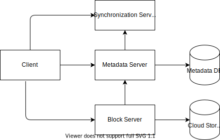
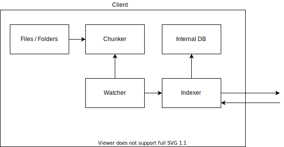
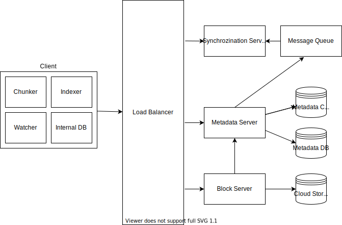

# Dropbox / Google Drive / OneDrive Design
## Requirements of the system
### Functional Requirements
1. Users can upload/download/delete/update files from any device that they are logged in. 
2. Service should support automatic synchronization between devices, i.e. after uploading a file on one device, it should get synchronized on all devices. 

### Non Functional Requirements
1. System should support large storing large files upto a GB
2. Satisfying ACID properties are required. Atomicity, consistency, isolation and durability of all file operations should be guranteed. 
    * Atomic - File upload should be all or none
    * Consistency - Both versions on device and server should be the same
    * Isolation - Ensure multiple transactions at same time, with data consistency
    * Durability - Highly durable
3. The system should be able to handle a high number of reads and writes. Read to write ratio is comparable in this case.
4. The system should be able to scale to an enormous number of users (Google Drive has over 1 billion active users as of July 2018).
5. Minimum possible network bandwidth should be utilized for file synchronization.
6. There should be minimum latency in file transfer.
7. System should be highly available. 
### Not in scope
1. Access control
2. Offline editing
## Capcity Estimation / Constraints / Scale
* Total users: 100M 
* Daily Active Users (DAU): 50M
* QPS: ~500M requests / day (~9000 queries / second)
* Storage estimate: Each user has average 200 files, and each file size is average 100 KB.
    * Total files = 100M * 200 = 20B
    * Total storage = 20B * 100KB = 2PM
* Read/Write ratio = 1:1

## APIs
We primarily need 2 basic APIs:
1. Upload a file<br/>
URL: https://api.example.com/files/upload<br/>
Params: data = Local file to be uploaded
2. Download a file<br/>
URL: https://api.example.com/files/download<br/>
Params: data = Download file path

## Uploading files in Chunks
The non-functional requirements, including minimum bandwidth and minimum latency are both very important and is exactly why Google Drive and similar services choose to upload files in chunks rather than uploading a single large file.<br/>
We may divide the file into smaller chunks to make it easier to upload. Details of chunks can be included in metadata. Naming of chunks can be done by the hash value of chunks content. This strategy will help us in many ways:
1. Bandwidth optimisation: In case of file upload failure, we don't need to upload whole file again, only failing chunk will be retried. If user updates the file, only modified chunk will be sent. Less amount of data transfer between client and server will reduce network bandwidth and most importantly, it will help us achieve a better response time.
2. Cloud storage utilisation: In case of update, as we are sending only the modified chunks to the server, instead of the entire file again, it will decrease the cloud storage consumption.
3. Concurrency Utilisation: With multiple smaller data chunks, we can make use of concurrency also to upload/download the file using multi threading or multi processes.
4. Version Control: As we are only transmitting the modified chunks in case of updates, it helps us in proving a history of versions of the file. We can directly lookup at the modified chunks to see the modifications.

## High Level Design

### Client
A client application on user's device talks to our service to upload, download and modify files to backend cloud storage.
### Metadata Server
We store the metadata & indexes of all chunks in our database as we have to track it. Important thing here is that we are not storing the actual file/chunks itself here, we are storing only the metadata information to retrieve the file later. It is also responsible for maintaining the history (versioning) of files.
### Block Server
Cloud/Block storage stores all the chunks, uploaded by users to the service. As we have metadata database, separate from storage, we can use any cloud storage approach eg - Amazon S3, Azure etc.<br/><br/>
When Dropbox started, they used S3 as block storage. However as they grew, they developed an in-house multi-exabyte storage system known as Magic Pocket. In magic Pocket, files are split up into blocks, replicated for durability, and distributed across data centres in multiple geographic regions.
### Synchronization Server
For every new update, synchronisation service is responsible to efficiently process updates and apply changes to other subscribed devices to keep their local db and remote db in sync.
## Component Design
### Client
Some essential operations for clients are:
* Upload and download files
* Detect file changes in the workspace folder
* Handle conflict due to concurrent updates
#### How do we handle file transfer efficiently?
As mentioned above, we can break each file into smaller chunks so that we transfer only those chunks that are modified and not the whole file. Let’s say we divide each file into fixed sizes of 4MB chunks. (Inspired from Dropbox)
#### Should we keep a copy of metadata with Clients?
Keeping a local copy of metadata not only enables us to do offline updates but also saves a lot of round trips to update remote metadata.
#### How can clients efficiently listen to changes happening with other clients?
1. The clients periodically checks with the server if there are any changes. The problem with this approach is that we will have a delay in reflecting changes locally, as clients will be checking for changes periodically compared to a server notifying whenever there is some change. If the client frequently checks the server for changes, it will not only be wasting bandwidth, as the server has to return an empty response most of the time, but will also be keeping the server busy. 
2. In order to solve above problem, we can use HTTP long polling. With long polling, the client requests information from the server with the expectation that the server may not respond immediately. If the server has no new data for the client when the poll is received, instead of sending an empty response, the server holds the request open and waits for response information to become available. Once it does have new information, the server immediately sends an HTTP response to the client, completing the open HTTP Request. Upon receipt of the server response, the client can immediately issue another server request for future updates.
<br/>

Based on the above considerations, we can divide our client into four parts:
1. Internal Metadata Database: Will keep track of all the files, chunks, their versions, and their location in the file system.
2. Chunker: Will split the files into smaller pieces called chunks. It will also be responsible for reconstructing a file from its chunks. Our chunking algorithm will detect the parts of the files that have been modified by the user and only transfer those parts to the Cloud Storage. This will save us bandwidth and synchronization time.
3. Watcher: Will monitor the local workspace folders and notify the Indexer of any action performed by the users, e.g. when users create, delete, or update files or folders. Watcher also listens to any changes happening on other clients that are broadcasted by Synchronization service.
4. Indexer: Will process the events received from the Watcher and update the internal metadata database with information about the chunks of the modified files.
<br/>

### Metadata Database
The Metadata Database is responsible for maintaining the versioning and metadata information about files/chunks, users, and workspaces. The Metadata Database can be a relational database such as MySQL, or a NoSQL database. we just need to make sure we meet the data consistency. An example of sample metadata in JSON format:
```json
{
    "chunk_id": "string",
    "chunk_order": "number",
    "object": {
        "version": "number",
        "is_folder": "boolean",
        "file_name": "string",
        "file_extension": "string",
        "file_size": "number",
        "file_path": "string",
        "user": {
            "user_name": "string",
            "email": "string",
            "quota_limit": "number",
            "quota_used": "number",
            "device_id": "string"
        } 
    }
}
```
### Synchronization Service
The Synchronization Service is the component that processes file updates made by a client and applies these changes to other subscribed clients. To be able to provide an efficient and scalable synchronization protocol, we can consider using a messaging middleware between metadata server and the synchronization service. 

## Detailed Component Design Diagram

