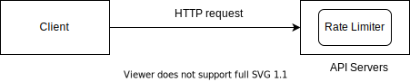

# Rate Limiter
* Limits the number of client requests allowed to be sent over a specific period
* Prevents resource starvation caused by Denial of Service (DoS) attack
* Limiting excess requests means fewer servers and allocating more resources to high priority APIs
* Important for companies that use third party APIs. For example, you are charged on a per call
basis for the following external APIs: check credit, make a payment, retrieve health records etc.
* Twitter: 300 number of tweets / 3 hours
* Google Doc: 300 / user / 60 seconds (Read request)

## Requirements
* Accurately limit excessive requests
* Low latency: The rate limiter should not slow down HTTP response time 
* Use as little memory as possible
* Distributed rate limiting: The rate limiter can be shared across multiple servers or processes
* Exception Handling: Show clear exceptions to users when their requests are throttled
* High fault tolernace: If there are any problem with the rate limiter(for example, the cache server goes offline),
it does not affect the entire system.

## High Level Design
### Where to put the rate limiter?
* Client Side Implementation: Generally speaking, client is an unreliable place to enforce rate limiting because
client requests can easily be forged by malicious actors. Moreover, we might not have control over the 
client implementation
* Server Side Implementation
#### API Server Side

#### Rate Limiter Middleware

#### API gateway
### Algorithms for rate limiting
#### Token bucket
#### Leaky bucket
#### Fixed window counter
#### Sliding window log
#### Sliding window counter