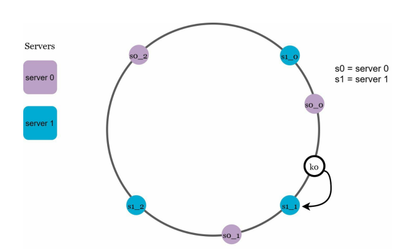

# Consistent Hashing
## Problem Statement
1. There should be no centralized authority who decides where the data is stored. Indeed, no single
node should know who all the other nodes in the system are, or even how many nodes there are.
2. The system must efficiently support dynamic additional and removal of nodes from the system.
3. Each node should store roughly the same amount of data.

## Challenges in Modular Hashing
If you have a collection of n cache machines then a common way of load balancing across them is to put object o in cache machine number hash(o) mod n. This works well until you add or remove cache machines, for then n changes and every object is hashed to a new location. This can be catastrophic since the originating content servers are swamped with requests from the cache machines. It's as if the cache suddenly disappeared.

## Solution 

<br/>
The hash function actually maps objects and caches to a number range. This should be familiar to every Java programmer - the hashCode method on Object returns an int, which lies in the range -2<sup>31</sup> to 2<sup>31</sup>-1>. Imagine mapping this range into a circle so the values wrap around.<br/><br/>
To find which cache an object goes in, we move clockwise round the circle until we find a cache point. So in the diagram above, we see object 1 and 4 belong in cache A, object 2 belongs in cache B and object 3 belongs in cache C. Consider what happens if cache C is removed: object 3 now belongs in cache A, and all the other object mappings are unchanged. If then another cache D is added in the position marked it will take objects 3 and 4, leaving only object 1 belonging to A.

### Virtual Nodes

<br/><br/>
This works well, except the size of the intervals assigned to each cache is pretty hit and miss. Since it is essentially random it is possible to have a very non-uniform distribution of objects between caches. The solution to this problem is to introduce the idea of "virtual nodes", which are replicas of cache points in the circle. So whenever we add a cache we create a number of points in the circle for it.
### Implementation
In order for consistent hashing to be effective it is important to have a hash function that mixes well. Most implementations of Object's hashCode do not mix well - for example, they typically produce a restricted number of small integer values - so we have a HashFunction interface to allow a custom hash function to be used. MD5 hashes are recommended here.
```java
import java.util.Collection;
import java.util.SortedMap;
import java.util.TreeMap;

public class ConsistentHashing<T> {
    private final HashFunction hashFunction;
    private final int numberOfReplicas;
    private final SortedMap<Integer, T> circle = new TreeMap<Integer, T>();

    public ConsistentHashing(HashFunction hashFunction, int numberOfReplicas, Collection<T> nodes) {
        this.hashFunction = hashFunction;
        this.numberOfReplicas = numberOfReplicas;

        for (T node: nodes) {
            add(node);
        }
    }

    public void add(T node) {
        for (int i=0; i<numberOfReplicas; i++) {
            circle.put(hashFunction.hash(node.toString() + i), node);
        }
    }

    public void remove(T node) {
        for (int i=0; i<numberOfReplicas; i++) {
            circle.remove(hashFunction.hash(node.toString() + i), node);
        }
    }

    public T get(Object key) {
        if (circle.isEmpty()) {
            return null;
        }

        int hash = hashFunction.hash(key);
        if (!circle.containsKey(hash)) {
            SortedMap<Integer, T> tailMap = circle.tailMap(hash);
            hash = tailMap.isEmpty() ? circle.firstKey() : tailMap.firstKey();
        }
        return circle.get(hash);
    }
}
```
The circle is represented as a sorted map of integers, which represent the hash values, to caches (of type T here).
When a ConsistentHash object is created each node is added to the circle map a number of times (controlled by numberOfReplicas). The location of each replica is chosen by hashing the node's name along with a numerical suffix, and the node is stored at each of these points in the map. <br/> <br/>
To find a node for an object (the get method), the hash value of the object is used to look in the map. Most of the time there will not be a node stored at this hash value (since the hash value space is typically much larger than the number of nodes, even with replicas), so the next node is found by looking for the first key in the tail map. If the tail map is empty then we wrap around the circle by getting the first key in the circle.
## Usage
* Partitioning component of Amazon’s Dynamo database 
* Data partitioning across the cluster in Apache Cassandra 
* Discord chat application 
* Akamai content delivery network 
* Maglev network load balancer 
## References
* https://tom-e-white.com/2007/11/consistent-hashing.html
* https://www.amazon.com/System-Design-Interview-insiders-Second/dp/B08CMF2CQF